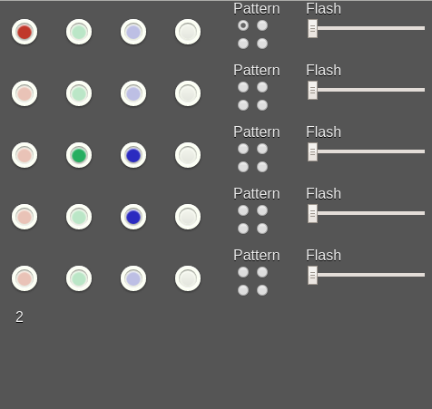

# #Octothorpe Lights

*A Node-based web service that allows control of DMX lights.*

This is a tool we're using to control a number of DMX stage lights, using a low-end USB uDMX dongles. See screenshot:

Currently there is no good way to configure this to work with other setups, but most likely the only things you would
need to change for a roughly similar setup are in `views/index.pug`. If you plan on using this, feel free to get in
touch and we'd be happy to work with you.

Updates/changes sync across all connected clients in real time using websockets
